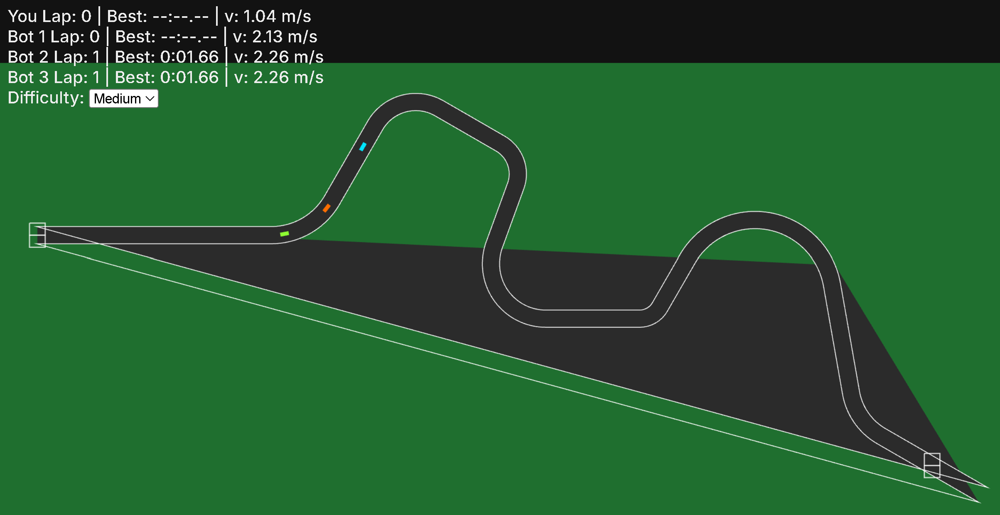

# Scalextric (Browser)

A browser-based, Scalextric-inspired slot-car racing game. Drive against multiple bot opponents on a technical track with a proper starting grid and countdown lights.



## Features
- Human vs bots: Race against more than one bot opponent.
- Technical tracks: Curves and straights with realistic cornering limits.
- Starting grid: Staged grid boxes, countdown, and false-start penalty.
- Deterministic simulation: Fixed-step physics with render interpolation.
- Controls: Keyboard and Gamepad support (with deadzones and smoothing).
- PWA: Installable and offline-ready via service worker.

## Quick Start
- Prereqs: Node.js 18+ and npm.
- Run the dev server:

```powershell
Push-Location "c:\Users\DanPeck\Scalextric-"
npm.cmd install
npm.cmd run dev
```

Open http://localhost:5173/ and use Arrow Up/W to throttle.

## How It Works
- Physics: Longitudinal acceleration with drag; lateral grip limits based on $\mu g$; de-slot behavior with off-track slide and auto-reslot (marshal delay).
- AI: Segment-aware corner speed targets + PID throttle; difficulty presets.
- Track: Sampled polyline with headings; left/right edges; pose interpolation.
- Rendering: Pixi.js sprites, filled track polygon, grass background; camera scaling to fit track bounds.
- Race flow: Start menu, stacked red lights during countdown, false-start detection, lap timing, best lap tracking.

## Configuration
- Bots: Adjust `botCount` in [src/main.ts](src/main.ts) to add/remove opponents.
- Track: Swap between tracks by changing the path used in [src/main.ts](src/main.ts).
- Difficulty: Use the HUD selector to change all bot difficulty.

## Add Your Screenshot
Place your image at `scalextric_picture.png` in the repository root, or update the path above to match your image location.

## Tech Stack
- TypeScript + Vite
- Pixi.js (WebGL 2D renderer)
- PWA (manifest + service worker)

## License
This project is for personal use and demonstration. Assets used should be licensed appropriately.